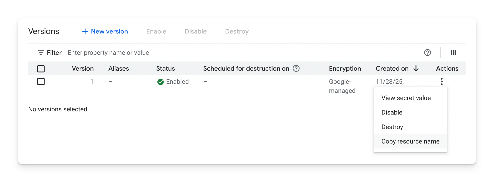

# GCP Secret Manager CasC SecretSource Plugin

A Jenkins plugin that uses Google Cloud Platform Secret Manager as a Jenkins Configuration as Code (CasC) Secret Source, for referencing GCP secrets in your Jenkins configuration.

## Prerequisites

- Jenkins with Configuration as Code plugin
- GCP credentials configured (via Application Default Credentials or service account)
- Access to GCP Secret Manager with appropriate IAM permissions (`roles/secretmanager.secretAccessor`)

## Usage

### Basic Secret Reference

**Format:** `${gcpSecretManager:projects/<project-id>/secrets/<secret-name>/versions/<version>}`

- `<project-id>`: Your GCP project ID (numeric or string)
- `<secret-name>`: The name of your secret in Secret Manager
- `<version>`: Version number (e.g., `1`, `2`) or `latest`

The resource name can be copied from the secrets versions page in Google Cloud Console, from `Actions` -> `Copy resource name`



Reference a secret stored in GCP Secret Manager using the following:

```yaml
credentials:
  system:
    domainCredentials:
      - credentials:
          - string:
              scope: GLOBAL
              id: "api-token"
              secret: "${gcpSecretManager:projects/PROJECT_ID/secrets/SECRET_NAME/versions/VERSION}"
```

### Extracting JSON Fields

The Configuration as Code plugin provides built-in JSON field extraction. For secrets containing JSON data, extract specific fields using the `json:` prefix:

```yaml
credentials:
  system:
    domainCredentials:
      - credentials:
          - usernamePassword:
              scope: GLOBAL
              id: "db-credentials"
              username: "${json:username:${gcpSecretManager:projects/12345678900/secrets/database-creds/versions/latest}}"
              password: "${json:password:${gcpSecretManager:projects/12345678900/secrets/database-creds/versions/latest}}"
```

This extracts `username` and `password` fields from a JSON secret. See the [CasC Secrets documentation](https://github.com/jenkinsci/configuration-as-code-plugin/blob/master/docs/features/secrets.adoc#json) for more examples and advanced usage.

## Configuration

### Secret Prefix

Secrets must be prefixed with `gcpSecretManager:` (default) to be resolved by this plugin. The prefix allows the plugin to quickly identify which secrets it should handle, avoiding unnecessary GCP Secret Manager lookups for secrets managed by other sources.

You can customize this prefix using an environment variable or system property:

**Environment variable:**
```bash
export GCP_SECRET_MANAGER_PREFIX="myprefix:"
```

**System property:**
```bash
-DGCP_SECRET_MANAGER_PREFIX="myprefix:"
```

Then reference secrets using your custom prefix:
```yaml
credentials:
  system:
    domainCredentials:
      - credentials:
          - string:
              scope: GLOBAL
              id: "api-token"
              secret: "${myprefix:projects/PROJECT_ID/secrets/SECRET_NAME/versions/latest}"
```

### Secret Caching

Secret values are cached temporarily while CasC applies a configuration to avoid redundant GCP Secret Manager lookups. This is useful when the same secret is referenced multiple times, like when using the `json:` prefix. The secret is fetched once and reused within that configuration reload.

The cache only exists during a single configuration reload and is discarded afterward. Secrets are fetched fresh on each subsequent reload.
